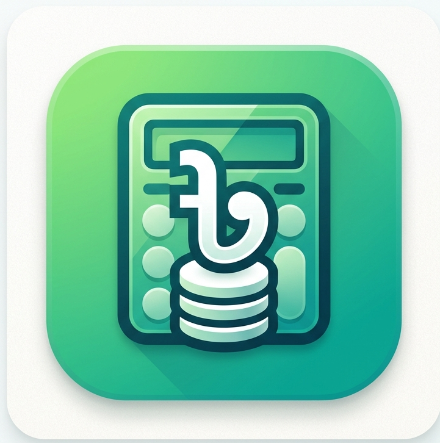
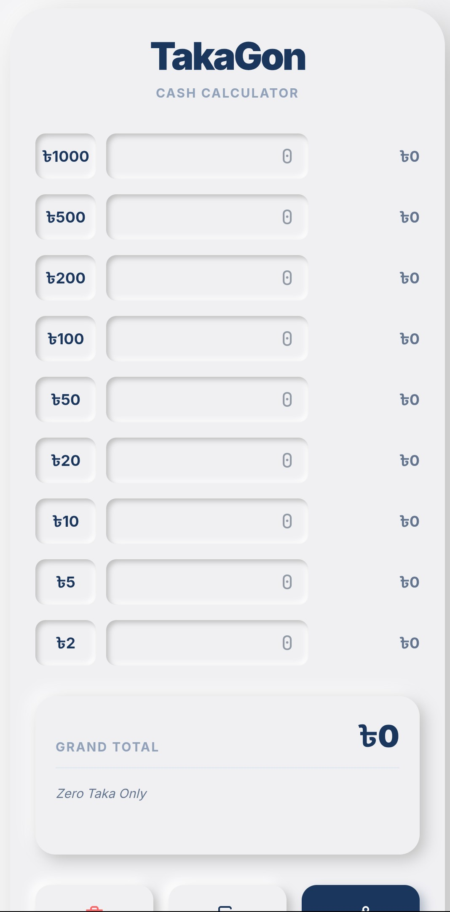
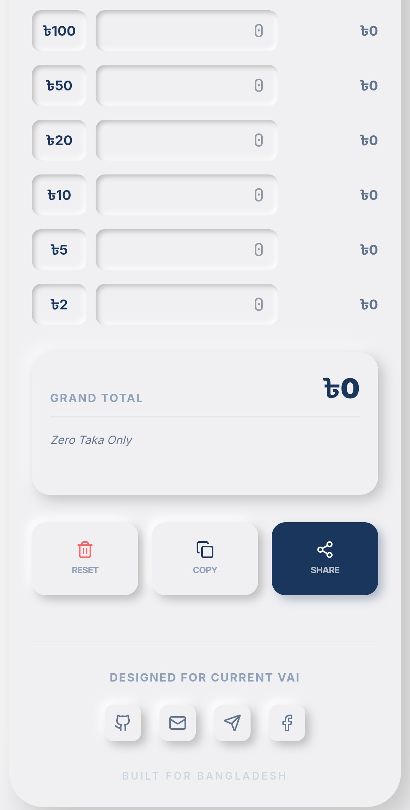

  

<h1 align="center">💰 TakaGon</h1>

  Smart Cash Calculator for Bangladesh 🇧🇩  
  <b>Fast • Simple • Accurate</b>

  

---

## 🚀 About TakaGon

**TakaGon** is a lightweight and user-friendly cash calculator app designed for everyday use in Bangladesh.  
It helps shop owners and general users perform quick and accurate calculations without hassle.

---

## ✨ Features

- ⚡ Instant and accurate calculation  
- 🎯 Clean and easy-to-use interface  
- 🇧🇩 Built for Bangladesh users  
- 📱 Lightweight and smooth performance  
- 💼 Perfect for shopkeepers & daily transactions  

---

## 📸 Screenshots

  
  

---

## 📥 Download

👉 Get the latest version from here:  
https://github.com/currentvai/TakaGon/releases

---

## 📦 Installation Guide

1. Download the APK file  
2. Enable **Install from Unknown Sources**  
3. Install the app on your device  
4. Open and start using 🚀  

---

## 👨‍💻 Developer

**Currnet Vai**  
📧 currnetvai@gmail.com  

---

## ⭐ Support

If you like this project:

- ⭐ Star this repository  
- 📢 Share with your friends  
- 💬 Give feedback for improvements  

---

## 🔮 Future Plans

- 📊 Advanced calculation features  
- 🌙 Dark mode  
- 💾 Save calculation history  
- 🚀 Performance improvements  

---

## 📜 License

This project is licensed under the MIT License.
